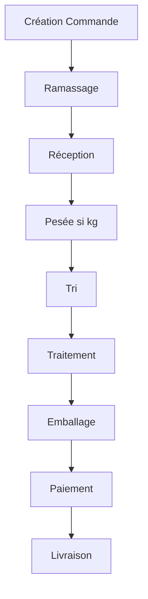

# 🧺 Yamo - Système de Gestion de Pressing

[](https://spring.io/projects/spring-boot)
[](https://www.oracle.com/java/)
[]()

Système complet de gestion de pressing développé avec Spring Boot, couvrant l'ensemble du workflow depuis la création de commande jusqu'à la livraison.

---

## 📋 Table des Matières

- [Fonctionnalités](#fonctionnalités)
- [Architecture](#architecture)
- [Installation](#installation)
- [Configuration](#configuration)
- [API Documentation](#api-documentation)
- [Workflow](#workflow)
- [Technologies](#technologies)

---

## ✨ Fonctionnalités

### Gestion des Commandes
- ✅ Création de commandes avec articles multiples
- ✅ Calcul automatique des prix (par pièce/kg/forfait)
- ✅ Gestion des instances d'articles
- ✅ Suivi du statut en temps réel

### Workflow Opérationnel
- ✅ **Réception** - Marquage et validation
- ✅ **Tri** - Organisation des articles
- ✅ **Traitement** - Suivi par étape (lavage, repassage, etc.)
- ✅ **Emballage** - Préparation pour livraison
- ✅ **Livraison** - Gestion logistique complète

### Facturation & Paiements
- ✅ Génération automatique de factures
- ✅ Support multi-méthodes de paiement
- ✅ Paiements partiels
- ✅ Génération de reçus
- ✅ Remises personnalisées

### Logistique
- ✅ Gestion des ramassages et livraisons
- ✅ Assignation aux chauffeurs
- ✅ Planning quotidien
- ✅ Pesée des articles
- ✅ Suivi GPS (prévu)

### Configuration
- ✅ Gestion des services de blanchisserie
- ✅ Définition des étapes de traitement
- ✅ Tarification flexible
- ✅ Catégories d'articles

---

## 🏗️ Architecture

```
com.irris.yamo/
├── controller/          # Contrôleurs REST
│   ├── OrderController
│   ├── BillingController
│   ├── LogisticController
│   └── ...
├── service/            # Interfaces des services
│   ├── OrderService
│   ├── BillingService
│   └── impl/          # Implémentations
├── entities/          # Entités JPA
│   ├── Order
│   ├── Article
│   ├── Payment
│   └── ...
├── repositories/      # Repositories JPA
├── dtos/             # Data Transfer Objects
├── mapper/           # Mappers Entity ↔ DTO
└── exception/        # Exceptions personnalisées
```

---

## 🚀 Installation

### Prérequis
- Java 17+
- Maven 3.8+
- PostgreSQL/MySQL
- Git

### Étapes

1. **Cloner le repository**
```bash
git clone <repository-url>
cd Yamo
```

2. **Configurer la base de données**
```bash
# Créer la base de données
createdb yamo_db
```

3. **Configurer application.properties**
```properties
spring.datasource.url=jdbc:postgresql://localhost:5432/yamo_db
spring.datasource.username=your_username
spring.datasource.password=your_password
spring.jpa.hibernate.ddl-auto=update
```

4. **Compiler et lancer**
```bash
mvn clean install
mvn spring-boot:run
```

5. **Accéder à l'application**
```
http://localhost:8080
```

---

## ⚙️ Configuration

### Base de données
Modifier `application.properties` :
```properties
spring.datasource.url=jdbc:postgresql://localhost:5432/yamo_db
spring.jpa.show-sql=true
spring.jpa.properties.hibernate.format_sql=true
```

### Taxes
Modifier dans `BillingServiceImpl.java` :
```java
BigDecimal taxRate = BigDecimal.valueOf(0.18); // 18% TVA
```

### Délai de paiement
Modifier dans `BillingServiceImpl.java` :
```java
invoice.setDueDate(LocalDateTime.now().plusDays(30)); // 30 jours
```

---

## 📡 API Documentation

### Base URL
```
http://localhost:8080/api
```

### Endpoints Principaux

#### Commandes
```http
POST   /api/orders                     # Créer commande
GET    /api/orders                     # Liste commandes
GET    /api/orders/{id}                # Détail commande
GET    /api/orders/customer/{id}       # Commandes client
DELETE /api/orders/{id}                # Supprimer
```

#### Facturation
```http
POST   /api/billing/invoice/{orderId}         # Générer facture
GET    /api/billing/invoice/{invoiceId}       # Détail facture
GET    /api/billing/calculate/order/{id}      # Calculer total
```

#### Réception
```http
POST   /api/reception/order/{id}       # Réceptionner
GET    /api/reception/pending          # En attente
```

#### Tri
```http
POST   /api/sorting/article/{id}       # Trier article
GET    /api/sorting/pending            # À trier
```

#### Traitement
```http
POST   /api/processing/instance/{id}/complete  # Marquer traitée
```

#### Emballage
```http
POST   /api/packaging/order/{id}       # Emballer
GET    /api/packaging/ready            # Prêtes
```

#### Paiements
```http
POST   /api/payments/order/{id}                        # Enregistrer
POST   /api/payments/order/{id}/payment/{id}/validate  # Valider
```

#### Logistique
```http
POST   /api/logistics/tasks/order/{id}        # Créer tâche
PUT    /api/logistics/tasks/{id}/assign/{driverId}  # Assigner
POST   /api/logistics/tasks/{id}/start        # Démarrer
POST   /api/logistics/tasks/{id}/complete     # Terminer
```

### Exemples de Requêtes

#### Créer une commande
```json
POST /api/orders
{
  "customerId": 1,
  "articles": [
    {
      "name": "Chemise",
      "quantity": 2,
      "material": "Coton",
      "color": "Blanc",
      "size": "M",
      "billingMode": "PAR_PIECE",
      "categoryId": 1,
      "servicesIds": [1, 2]
    }
  ]
}
```

#### Enregistrer un paiement
```json
POST /api/payments/order/1
{
  "orderId": 1,
  "paymentMethod": "CASH",
  "amount": 5000
}
```

---

## 🔄 Workflow



### Statuts de Commande

1. **CREATED** - Commande créée
2. **RECEIVED** - Réceptionnée au pressing
3. **SORTING_COMPLETED** - Articles triés
4. **IN_PRODUCTION** - En cours de traitement
5. **READY** - Prête pour livraison
6. **DELIVERED** - Livrée au client

---

## 🛠️ Technologies

### Backend
- **Spring Boot 3.x** - Framework principal
- **Spring Data JPA** - Persistance
- **Hibernate** - ORM
- **Lombok** - Réduction boilerplate
- **PostgreSQL/MySQL** - Base de données

### Outils
- **Maven** - Gestion des dépendances
- **Git** - Contrôle de version

---

## 📝 Structure des Données

### Entités Principales

- **Order** - Commande client
- **Article** - Article à traiter
- **ArticleInstance** - Instance individuelle
- **LaundryService** - Service de blanchisserie
- **ProcessStep** - Étape de traitement
- **ProcessStepTracking** - Suivi des étapes
- **Payment** - Paiement
- **Invoice** - Facture
- **LogisticTask** - Tâche logistique
- **Customer** - Client
- **Driver** - Chauffeur

---

## 🧪 Tests

### Lancer les tests
```bash
mvn test
```

### Tests unitaires
```bash
mvn test -Dtest=ServiceTests
```

### Tests d'intégration
```bash
mvn test -Dtest=ControllerTests
```

---

## 🔐 Sécurité

**À implémenter** :
- Spring Security
- JWT Authentication
- Role-based access control (RBAC)
- HTTPS

---

## 📈 Performances

**Optimisations recommandées** :
- Cache Redis pour les tarifs
- Pagination des listes
- Index sur les champs de recherche
- Connection pooling

---

## 🤝 Contribution

Ce projet est propriétaire. Pour toute contribution :
1. Fork le projet
2. Créer une branche (`git checkout -b feature/AmazingFeature`)
3. Commit (`git commit -m 'Add AmazingFeature'`)
4. Push (`git push origin feature/AmazingFeature`)
5. Ouvrir une Pull Request

---

## 📄 Licence

Propriétaire - Tous droits réservés © 2025 Yamo

---

## 📞 Support

Pour toute question ou support :
- Email: support@yamo.com
- Documentation: [IMPLEMENTATION_COMPLETE.md](IMPLEMENTATION_COMPLETE.md)

---

## 🎯 Roadmap

### Version 1.1
- [ ] API Gateway
- [ ] Service de notifications
- [ ] Dashboard analytics
- [ ] Application mobile

### Version 1.2
- [ ] Intégration Mobile Money
- [ ] Export PDF factures
- [ ] Géolocalisation temps réel
- [ ] Multi-tenancy

### Version 2.0
- [ ] Intelligence artificielle (prédiction durée)
- [ ] QR Code tracking
- [ ] Programme fidélité
- [ ] API publique

---

## 🙏 Remerciements

Développé avec ❤️ pour moderniser la gestion des pressings.

---

**Version** : 1.0.0  
**Dernière mise à jour** : 2025-11-07  
**Statut** : ✅ Production Ready
